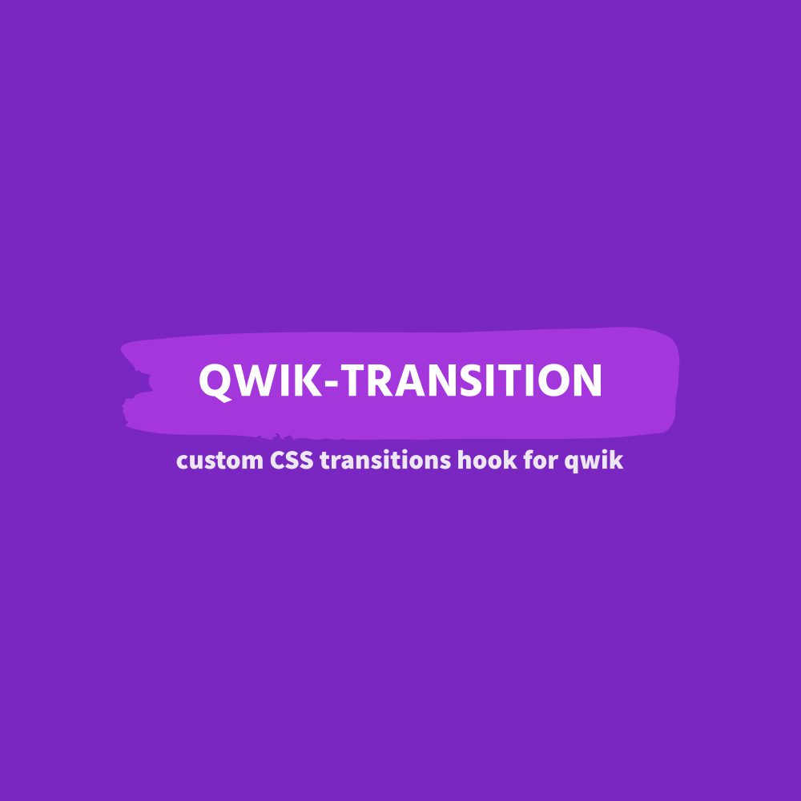

<p align="center">
  <br>
  
  <br>
  <br>
</p>

<h1 align='center'>qwik-transition</h1>

<div align='center'>
Light-weight (<1kb) custom hook for qwik to help with CSS transitions. Based on <a href="https://github.com/iamyoki/transition-hook">@iamyoki/transition-hook</a>.
<br><br>
  <a href='https://img.shields.io/npm/v/qwik-transition?label=npm%20version'>
  
  </a>
  <a href='https://opensource.org/licenses/MIT'>
  
  </a>
  <a href='#contributors'>
  
  </a>
</div>

## Installation

```bash
npm install qwik-transition
```

## Usage

### useCSSTransition

This hook transforms a boolean state into a transition stage, that allows you to control your CSS transitions.

```jsx
import { component$, useSignal } from "@builder.io/qwik";
import { useCSSTransition } from "qwik-transition";

export default component$(() => {
  const onOff = useSignal(true);
  const { stage, shouldMount } = useCSSTransition(onOff, { timeout: 300 });

  return (
    <div>
      <button
        onClick$={() => {
          onOff.value = !onOff.value;
        }}
      >
        toggle
      </button>
      {shouldMount.value && (
        <p
          style={{
            transition: ".3s",
            opacity: stage.value === "enterTo" ? 1 : 0,
          }}
        >
          Hey guys, I'm fading
        </p>
      )}
    </div>
  );
});
```

## API Reference

### useCSSTransition(signal, { timeout, transitionOnAppear })

```js
  const { stage, shouldMount } = useCSSTransition(onOff, { timeout: 300, transitionOnAppear: true });
```

| Parameters | Type      | Description                                                           |
| :--------- | :-------- | :-------------------------------------------------------------------- |
| `state`    | `boolean` | **Required**. Your boolean state, which controls animation in and out |
| `options`  | `{timeout: number = 0; transitionOnAppear: boolean = false;}`  | **timeout:** How long before the transition ends and the component unmounts. **transitionOnAppear** Whether to set the `enterFrom` stage value on the initial mount of the page or not.         |

<br>

| Returns       | Type                                | Description                                         |
| :------------ | :---------------------------------- | :-------------------------------------------------- |
| `stage`       | Stage: "enterFrom" | "enterTo" | "leaveFrom" | "leaveTo" | "idle" | Use five different stage to perform your transition |
| `shouldMount` | `boolean`                           | Whether the component should be mounted or not             |

## Acknowledgment

Thanks to https://github.com/iamyoki/transition-hook that this hook is an adaptation from.

## License

[MIT](https://choosealicense.com/licenses/mit/)


